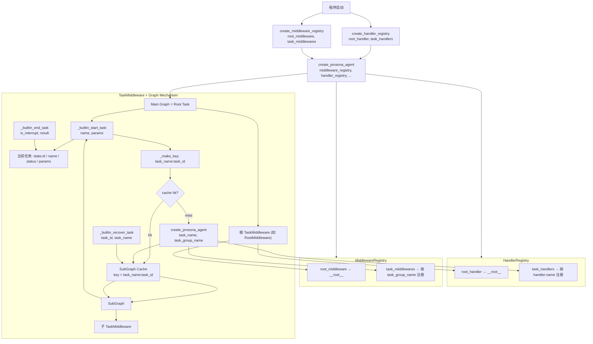

## Prosona Agent 机制总览（Scheduled Task Based）

本节描述 Prosona 在目标架构下的 **Agent 机制**，重点聚焦在：

- **A2A 业务数据消息协议**：Activity/SCO 生命周期等通过 `A2ABizDataMessage` 下发的标准格式见 [A2A Biz Data 协议](./protocol_a2a_biz_data.md)。
- **TaskMiddleware 作为核心机制中枢**
- **Root Task（Session）作为主 Graph**，由 `root_handler` 注册为 `__root__`
- **通过 `_builtin_start_task` / `_builtin_end_task` / `_builtin_recover_task` 实现的嵌套子任务与子 Graph**
- **HandlerRegistry 与 MiddlewareRegistry 双注册表**：Handler 按 name 注册；Middleware 按 task_group_name 注册；子 Graph 构建时按 task_name 查 Handler、按 task_group_name 查 Middleware 类。
- **当前任务扁平状态**：无独立 task_stack；当前任务由 state 的 id/name/status/params 表示；父任务身份通过 `_get_current_task_info(state)` 获取。

### 整体结构图（Mermaid）



### 关键机制说明（配合结构图理解）

- **Main Graph = Root Task**
  - 程序启动时：`create_handler_registry(root_handler=..., task_handlers=...)` 得到 `handler_registry`；`create_middleware_registry(root_middleware=..., task_middlewares=...)` 得到 `middleware_registry`；再 `create_prosona_agent(system_prompt=..., middleware_registry=..., handler_registry=...)` 创建主 Graph。子 Graph 由 TaskMiddleware 在 `_get_or_create_subgraph` 内调用 `create_prosona_agent` 时复用同一 `middleware_registry` 与 `handler_registry`。
  - 根 Handler：`root_handler` 注册为 `ROOT_HANDLER_NAME`（`"__root__"`）；未传时使用默认 `TaskHandler()`。根 Middleware 类：从 `middleware_registry.get(ROOT_MIDDLEWARE_GROUP_NAME)` 取得（如 AOM 的 `RootMiddleware`）。

- **MiddlewareRegistry 与 TaskMiddleware**
  - `MiddlewareRegistry` 映射 `task_group_name` → Middleware 类。根注册为 `ROOT_MIDDLEWARE_GROUP_NAME`（`"__root__"`）；各层如 `"project"`、`"activity"`、`"sco"` 由子类 `task_group_name` 注册。`create_prosona_agent` 通过 `middleware_registry.get(task_group_name)` 取得当前层 Middleware 类并实例化。
  - **TaskMiddleware** 是机制中枢：维护**当前任务扁平状态**（state 的 `id`、`name`、`status`、`params`）；父任务身份通过 `_get_current_task_info(state)` 获取，不维护独立 `task_stack`。
  - 内置工具行为：
    - `_builtin_start_task(name, params)`：始终使用 `tool_call_id` 作为 `task_id`（框架自动分配，跨 resume 稳定），`params` 存入 `state["params"]` 并传递给 `abefore` / `arecover`（handler 从 `state.get("params")` 获取）。`_make_key(task_name, task_id)` 得 key，从 SubGraph Cache 取或建 SubGraph（`_get_or_create_subgraph`），通过 `_get_suspended_state` 判断是否处于暂停状态（interrupt resume），切换当前任务身份并执行子 Graph。
    - `_builtin_end_task(is_interrupt, result)`：`result` 为可选 Dict（含 summary、reason、next_intent 等字段），调用当前任务 `ainterrupt`/`aafter`，将结果存入 `result`，通过 state 更新与 ToolMessage 回传父 Task，并调用父 Task 的 `aafter_task`。
    - `_builtin_recover_task(task_id, task_name)`：与 `start_task` 共享同一 SubGraph Cache key（`task_name:task_id`），复用同一 graph 实例和 checkpointer，确保 recover 能继续之前的会话。通过 `_get_suspended_state` 判断是暂停中的 resume 还是新的 recover 执行。

- **SubGraph Cache 与子 Graph 构建**
  - Cache key：`task_name:task_id`（`_make_key(*parts)` 返回值，如 `"project:call_xxx"`）。start_task 与 recover_task 共用同一 key，共享 graph 实例与 checkpointer。
  - `_get_or_create_subgraph(key, task_name)` → `CompiledStateGraph`：若 key 不在 Cache，则 `get_handler(task_name)` 取 Handler（回退顺序：`task_name` → `task_group_name` → `"general"`，均未注册则 `ValueError`），`task_group_name` 取当前 middleware 的 `sub_task_group_name` 或参数，再 `create_prosona_agent(..., task_name=task_name, task_group_name=effective_group)` 创建子 Graph 与子 TaskMiddleware，放入 Cache。
  - `_get_suspended_state(subgraph, thread_id)` → `Optional[Dict]`：若 graph 处于 interrupt 暂停状态（`state.next` 非空），返回 checkpoint 中的真实 state；否则返回 None。resume 路径直接使用此真实 state（含正确的 status、messages 等），无需人造 pseudo-state。

- **HandlerRegistry 与绑定关系**
  - `HandlerRegistry`：`root_handler` 注册为 `"__root__"`；`task_handlers` 中每个按 `handler.name` 注册。初始化时已包含默认 `"__root__"` 与 `"general"`。
  - Handler 查找：`get_handler(name)` 回退顺序为 `name` → 当前 middleware 的 `task_group_name` → `"general"`，保证同组内可共用一个 Handler。

- **堆栈式嵌套执行语义**
  - 任意 Task（Root 或子 Task）均可通过 `_builtin_start_task` 创建子 Task，形成嵌套：Root → Project → Activity → SCO → …。
  - `_builtin_end_task` 后控制权回到父 Task，父 Task 可根据回传的 summary 继续规划、结束自身或通过 `_builtin_recover_task` 恢复某子 Task。

### TaskMiddleware 的状态设计（基础 TaskState）

框架级基础状态定义在 `core.middleware.task_state.TaskState`（继承自 `ProsonaAgentState`，后者继承 LangChain `AgentState`；通过 `core.middleware.task_middleware` re-export），**框架级字段**如下（业务层如 AOM 在各自 state_schema 中扩展）：

- **`id`**
  - 当前任务实例 id。子任务的 `id` 始终使用 `tool_call_id`（由 LLM 在 AIMessage 的 tool_calls 中生成，格式为 `"call_xxx..."`），确保框架标识与业务标识解耦。在 interrupt resume 场景中 LangGraph 重新执行同一 tool call，`tool_call_id` 保持不变，确保 cache key 和 thread_id 稳定。SubGraph Cache key 为 `name:id`，start_task 与 recover_task 共用。

- **`name`**
  - 当前任务逻辑名称/类型，用于 Handler 查找与 SubGraph 标识。

- **`status`**
  - 当前任务状态：`pending` / `running` / `paused` / `completed` / `interrupted` / `recovering`。由 TaskMiddleware 在生命周期中更新。

- **`params`**
  - 当前任务启动时传入的参数（`_builtin_start_task` 的 `params`）。

- **`sub_tasks`**
  - 当前 Task 直接派生的子任务 id 列表，用于关系追踪。

- **`result`**
  - `Dict[str, Any] | None`。任务结束时的结果数据，可含 `summary`（摘要）、`reason`（中断原因）、`next_intent`（用户后续意图）等字段。由 `_builtin_end_task` 的 `result` 参数设置，在 `ainterrupt`/`aafter` 中写入 state。子 Task 的 `result` 通过 ToolMessage 回传给父 Task。父层 `aafter_task` 可通过 `sub_state.get("params")` 直接获取子任务的启动参数。

- **`mode`**
  - 当前任务的启动模式：`"start"`（首次进入）或 `"recover"`（恢复路径），由 `abefore_agent` 在生命周期分发时设置。

**来自 ProsonaAgentState 的字段**（如 `context_id`、`parts`、`user_profile`、`language` 等）：用于会话/租户、A2A 请求体与用户上下文，见 `agentickit.prosonaagent.state`。

> 说明：对话与工具消息由 LangGraph/Agent 的 `messages` 等状态管理；Task 级别若需与 summary/压缩策略结合，可在 Middleware/Handler 中按需扩展。

### 子 Task 执行与 result 回传机制

- 父 Task 调用 `_builtin_start_task(name=..., params=...)` 时：
  - TaskMiddleware 使用 `tool_call_id` 作为 `task_id`（框架自动分配），`params` 存入 `state["params"]` 并传递给 `abefore`（handler 从 `state.get("params")` 获取）。按 `_make_key(task_name, task_id)` 获取或构建 SubGraph，切换当前任务身份并执行子 Graph（阻塞直至子任务结束或被 interrupt）；
  - 对父 Task 而言相当于一次工具调用，等待子 Task 执行完毕。父层 `aafter_task` 可通过 `sub_state` 获取子任务的完整信息（包括 `sub_state.get("params")`、`sub_state.get("result")` 等）。

- 子 Task 调用 `_builtin_end_task(is_interrupt=..., result=...)` 结束自身时：
  - `result` 为可选 Dict，可含 `summary`（摘要）、`reason`（中断原因）、`next_intent`（用户后续意图）等字段；
  - TaskMiddleware 会调用当前任务的 `ainterrupt`/`aafter`，将 `result` 存入 `result`，并将子 Task 的 `result` 通过 state 更新与 **ToolMessage** 回传父 Task，同时调用父 Task 的 `aafter_task`。

- 效果：父 Task 把子 Task 视为**高阶工具**——`_builtin_start_task` 调用，`_builtin_end_task` 返回 result；子 Task 的 result 通过 ToolMessage 被父 Task 消费。

### 生命周期与内置工具设计

#### 1. TaskHandler 生命周期钩子

**设计原则**：所有当前任务维度的生命周期方法签名统一为 `(state, runtime)`，handler 从 state 自取所需信息（`state["id"]`、`state["name"]`、`state.get("params")`、`state.get("result")` 等）。Middleware 在调用 handler 前，会将即将生效的 updated 字段合并入 state（`merged = {**state, **updated}`），因此 handler 收到的 state 已反映最新状态（如 `status` 已切换为目标值）。

**Handler 返回 delta**：handler 返回的 dict 只包含**新增或变更的字段**。对于 `messages` key，`_merge_updates` 会将 handler 返回的 messages **拼接**（而非覆盖）到已有 messages 后面。因此 handler 不应从 state 拷贝已有 messages 再返回（会导致重复），只需返回新增的 messages。

**Skills 自动合并**：`TaskMiddleware.__init__` 通过 `_create_skills` 将 handler 的 `skills` 与 middleware 的 `skills` 合并（去重、保序）。合并后的 `self.skills` 用于两处：`abefore` 中注入 skill 完整内容（body）；`ModelEnhanceMiddleware` 注入 skill 概览（名称+描述+使用指引）到 system_message。AOM middleware 不需要单独处理 skill context。

**Enriched State 模式**：AOM middleware 加载的业务数据（如 SCO middleware 的 sco、activity、order 等）通过 enriched state 传递给 super().abefore()：`enriched_state = {**state, ...业务数据}`，使 handler 在 abefore 中可直接从 state 读取。AOM middleware 不应就地修改 state。

**`is_interrupt` 不作为参数传递**：原 `aafter` 的 `is_interrupt` 参数已移除。Handler 需要区分时通过 `state.get("status")` 推导：`status == "interrupted"` 即为中断，`status == "completed"` 即为正常完成。子任务维度同理，从 `sub_state.get("status")` 推导。

**当前任务维度**：

| 方法 | 签名 | 说明 | Handler 可从 state 获取 |
|------|------|------|------------------------|
| **abefore** | `(state, runtime)` | 任务开始 | `state["id"]`、`state["name"]`、`state.get("params")`、`state["status"]` == `"running"` |
| **apause** | `(state, runtime)` | 暂停 | `state["status"]` == `"paused"` |
| **aresume** | `(state, runtime)` | 恢复 | `state["status"]` == `"running"` |
| **ainterrupt** | `(state, runtime)` | 中断结束 | `state["status"]` == `"interrupted"`、`state.get("result")` |
| **arecover** | `(state, runtime)` | 恢复路径重新进入 | `state.get("params")`、`state["status"]` == `"running"` |
| **aafter** | `(state, runtime)` | 正常结束 | `state["status"]` == `"completed"`、`state.get("result")` |

> Middleware 会在调用 handler 前将 updated 字段 merge 到 state。例如 `abefore` 时 handler 收到的 state 中 `status` 已经是 `"running"`，`id`/`name` 已设置。

**子任务维度**（在父任务 Handler 上调用）：

| 方法 | 签名 | 说明 |
|------|------|------|
| **abefore_task** | `(state, runtime, sub_task_id, sub_task_name)` | 子任务开始（子任务尚未执行，无完整 sub_state） |
| **arecover_task** | `(state, runtime, sub_task_id, sub_task_name)` | 子任务恢复（同上） |
| **ainterrupt_task** | `(state, runtime, sub_state)` | 子任务中断。`sub_state` 为子任务完成后的 result_state |
| **aafter_task** | `(state, runtime, sub_state)` | 子任务结束。`sub_state` 同上 |

`sub_state` 包含：
- `sub_state["id"]` — 子任务 ID
- `sub_state["name"]` — 子任务名称
- `sub_state.get("status")` — `"completed"` 或 `"interrupted"`（即原 `is_interrupt = status == "interrupted"`）
- `sub_state.get("result")` — 子任务结果
- `sub_state.get("params")` — 子任务启动参数（含业务 ID）

**用户输入**：

- **aafter_user_input**(state, runtime, user_input, action, params)：用户输入后回调。

#### 2. Root Task（Session）与子 Task

- **Root Task**：主 Graph 对应 Root Task，由 `middleware_registry.get(ROOT_MIDDLEWARE_GROUP_NAME)` 得到的 Middleware 类（如 AOM 的 `RootMiddleware`）与 `handler_registry.get(ROOT_HANDLER_NAME)` 得到的 Handler 处理；AOM 中 RootMiddleware 在 `abefore` 等中加载项目/会话上下文，子任务使用 `ProjectMiddleware`（`sub_task_group_name="project"`）。
- **子 Task**：通过 `_builtin_start_task(name, params)` 创建，`task_id` 始终使用 `tool_call_id`（框架自动分配）；`params` 存入 `state["params"]`，handler 在 `abefore` / `arecover` 中通过 `state.get("params")` 获取所需的实体 ID。
- **interrupt / recover**：`_builtin_end_task(is_interrupt=True, result={...})` 中断当前任务；`_builtin_recover_task(task_id, task_name)` 与 `start_task` 共享同一 SubGraph（通过相同的 cache key `task_name:task_id`），以 `status="recovering"` 重新进入执行，前一轮的会话上下文通过 checkpoint 保留。Resume 路径（用户操作触发的暂停恢复、quit 等）由 `_on_interrupt_resume` 机制处理，不经过 `abefore_agent`。

#### 3. 内置工具接口约定

- **`_builtin_start_task`**
  - 参数：`name`（任务类型，对应 Handler 的 name 或 middleware 的 `sub_task_group_name`）、`params`（可选业务参数字典，含业务实体 ID 等）。
  - 行为：`task_id` 始终使用 `tool_call_id`（框架自动分配，跨 resume 稳定），`params` 存入 `state["params"]`，handler 在 `abefore` / `arecover` 中通过 `state.get("params")` 获取所需的实体 ID。`_get_or_create_subgraph(key, task_name)` 取或建 SubGraph。通过 `_get_suspended_state` 判断 graph 是否处于 interrupt 暂停状态：暂停中则进入 resume 路径（`_on_interrupt_resume`），否则进入首次执行路径（`abefore_task` + `abefore`）。子任务结束后，`params` 自动注入到 `result` 中。

- **`_builtin_end_task`**
  - 参数：`is_interrupt`（是否中断结束）、`result`（可选 Dict，含 summary / reason / next_intent 等字段）。
  - 行为：先将 `result` 合并入 `state["result"]`，再调用当前 Task 的 `ainterrupt`（`is_interrupt=True`）或 `aafter`（`is_interrupt=False`）。Handler 从 `state.get("result")` 获取结果数据。结束后通过 state 与 ToolMessage 回传父 Task，并调用父 Task 的 `aafter_task(state, runtime, sub_state)`。通过 `goto=END` 退出当前子 Graph。

- **`_builtin_recover_task`**
  - 参数：`task_id`、`task_name`。
  - 行为：与 `start_task` 共用 cache key（`task_name:task_id`），复用同一 graph 实例与 checkpointer。通过 `_get_suspended_state` 判断：暂停中则 resume，否则调用父 Task 的 `arecover_task`，以 `status="recovering"` 进入子 Graph 执行（恢复路径）。`params`/`sub_tasks` 不覆盖，从 checkpoint 保留。

#### 4. `_on_interrupt_resume` 机制

当 SubGraph 因 interrupt 暂停后，后续用户请求到达父 Task 时，`_builtin_start_task`/`_builtin_recover_task` 通过 `_get_suspended_state` 发现 graph 处于暂停状态，进入 `_on_interrupt_resume` 而非 `abefore_agent`。该方法包含两条互斥分支：

1. **有 Human Message**（用户文本输入）：调用子 Middleware 的 `aafter_user_input`，将更新合并到 sub_state，以 `Command(update=..., resume=response)` 恢复子 Graph 执行。
2. **无 Human Message**（Action-based）：根据 action 分发 `apause` / `aresume` 等生命周期调用，合并状态后以 `Command` 恢复。

> 关键区别：`_on_interrupt_resume` 不触发 `abefore_agent`；`abefore_agent` 仅在 SubGraph 首次进入（`status=pending/recovering`）时调用。已处于 `running` 或 `paused` 的任务在 `abefore_agent` 中不做生命周期变更。

#### 5. `awrap_model_call` 与 Middleware 链

模型调用前经过三层 Middleware（按顺序）：

1. **`TaskMiddleware.awrap_model_call`**：取当前 task_name 对应的 Handler，委托 `handler.awrap_model_call(request, handler)`，允许业务层在模型调用层面做进一步定制（如修改 prompt、调整参数）。
2. **`ModelEnhanceMiddleware.awrap_model_call`**：强制 `tool_choice="required"`（框架的任务驱动设计依赖工具调用来推进流程）；将 `build_skill_system_prompt` 生成的 skill 概览（名称+描述+使用指引）追加到 `request.system_message`。
3. **`ModelFallbackMiddleware.awrap_model_call`**：主模型调用失败时自动切换到 fallback 模型重试。

### 上下文压缩（可选扩展）

框架通过 `TaskMiddleware._compressible_message` 生成带 `COMPRESSIBLE_KEY` 的 SystemMessage，便于后续 **ContextEditingMiddleware** 等按需压缩。可扩展方向：

- 在模型调用前按 token 数裁剪历史 ToolMessage 或排除关键工具；
- 引入 `_builtin_memory` 等将消息落盘后从当前流移除，与 Task 级 `summary` 配合。

### 项目结构与模块（当前代码布局）

```
agentickit/prosonaagent/
├── agent.py              # 对外入口，re-export create_handler_registry, create_middleware_registry, create_prosona_agent
├── agent_executor.py
├── core/                 # 框架层
│   ├── state.py          # ProsonaAgentState（context_id, parts, user_profile, language 等）
│   ├── factory.py        # create_handler_registry, create_middleware_registry, create_prosona_agent
│   ├── handler/
│   │   ├── task_handler.py       # TaskHandler 接口与生命周期钩子
│   │   └── handler_registry.py   # HandlerRegistry, ROOT_HANDLER_NAME, GENERAL_HANDLER_NAME
│   ├── middleware/
│   │   ├── task_state.py             # TaskState（定义文件，通过 task_middleware re-export）
│   │   ├── task_middleware.py        # TaskMiddleware 机制中枢
│   │   ├── middleware_registry.py    # MiddlewareRegistry, ROOT_MIDDLEWARE_GROUP_NAME
│   │   ├── model_enhance_middleware.py  # ModelEnhanceMiddleware（tool_choice + skill system prompt）
│   │   └── speaker_middleware.py     # SpeakerMiddleware + Sender/TTSConfig/Speaker 类型
│   └── tools/            # 内置工具
│       ├── _builtin_start_task, _builtin_end_task, _builtin_recover_task（由 TaskMiddleware 闭包生成，非独立文件）
│       ├── _builtin_get_skill_information, _builtin_get_skill_resource（默认 builtin tools）
│       ├── _builtin_conversation
│       └── _builtin_write_scratchpad
├── aom/                  # AOM 业务适配层
│   ├── state.py          # RootTaskState, ProjectTaskState, ActivityTaskState, SCOTaskState
│   ├── handler/
│   │   └── sco_task_handler.py   # SCOTaskHandler（SCO 级 Handler 基类，含 aget_card）
│   ├── middlewares/      # RootMiddleware, ProjectMiddleware, ActivityMiddleware, SCOMiddleware
│   ├── tools/            # get_activity_information 等
│   ├── api.py, context.py, query.py, message.py, types.py, ...
└── utils/                # 工具函数
    ├── context.py        # 上下文构建（build_skill_information_context_list 等）
    ├── agent_proxy.py, message.py, streaming.py, xml.py, ...
```

### 基于 AOM 的第二层扩展（业务层适配）

在框架层（TaskMiddleware + TaskHandler）之上，AOM 按 Root / Project / Activity / SCO 四层扩展，每层对应一个 Middleware 类并注册到 `MiddlewareRegistry`：

- **Middleware 与 task_group_name**
  - **RootMiddleware**：`task_group_name="__root__"`，`sub_task_group_name="project"`；负责会话级上下文，子任务使用 **ProjectMiddleware**。
  - **ProjectMiddleware**：`task_group_name="project"`，`sub_task_group_name="activity"`；负责加载 project、modules、activities、预加载 SCO，注入项目/技能上下文；子任务使用 **ActivityMiddleware**。
  - **ActivityMiddleware**：`task_group_name="activity"`，`sub_task_group_name="sco"`；state_schema 为 Activity 层 State；负责加载 activity、sco_list，发送 `biz-common-activity-lifecycle`；子任务使用 **SCOMiddleware**。
  - **SCOMiddleware**：`task_group_name="sco"`；state_schema 为 SCO 层 State；负责加载 SCO、内容与历史，调用 start_sco/end_sco，发送 `biz-common-sco-lifecycle`。可将 **allow_sub_tasks** 设为 `False`，使 `.tools` 不包含 `_builtin_start_task`、`_builtin_recover_task`，仅保留 `_builtin_end_task`（SCO 为叶子，不再创建子任务）。

- **allow_sub_tasks**
  - 在 **TaskMiddleware**（及其子类）上配置：`allow_sub_tasks = True/False`。
  - 为 `False` 时该层 middleware 的 `.tools` 不包含 `_builtin_start_task`、`_builtin_recover_task`，仅保留 `_builtin_end_task`。
  - SCO 层可设 `allow_sub_tasks=False`；Activity 层为 True，可 `_builtin_start_task` 启动 SCO 子任务。

- **Handler 与 State**
  - Root Handler 注册为 `"__root__"`（如 AOM 的会话级 Handler）；项目加载与上下文由 RootMiddleware/ProjectMiddleware 在 `abefore` 等中完成。
  - Activity 层 Handler（name 如 `"activity"`）：编排 Activity，在 `aafter_task` 中跟踪完成 SCO、设置 current_sco_id 等，在 `aafter` 中通过 `result` 返回结果。
  - SCO 层：由具体业务 Handler 实现（如 `DrillGuideHandler`，name 与 SCO 类型对应）；Handler 可扩展 `tools`、`state_schema`、生命周期钩子。

**创建 Agent 示例**（见 `app/__main__.py`）：

```python
from agentickit.prosonaagent.agent import (
    create_handler_registry,
    create_middleware_registry,
    create_prosona_agent,
)
from agentickit.prosonaagent.aom import RootMiddleware, ProjectMiddleware, ActivityMiddleware, SCOMiddleware

handler_registry = create_handler_registry(
    task_handlers=[DrillGuideHandler()],  # 可选 root_handler=...
)
middleware_registry = create_middleware_registry(
    root_middleware=RootMiddleware,
    task_middlewares=[ProjectMiddleware, ActivityMiddleware, SCOMiddleware],
)
graph, _ = create_prosona_agent(
    system_prompt=SYSTEM_PROMPT,
    handler_registry=handler_registry,
    middleware_registry=middleware_registry,
)
```

